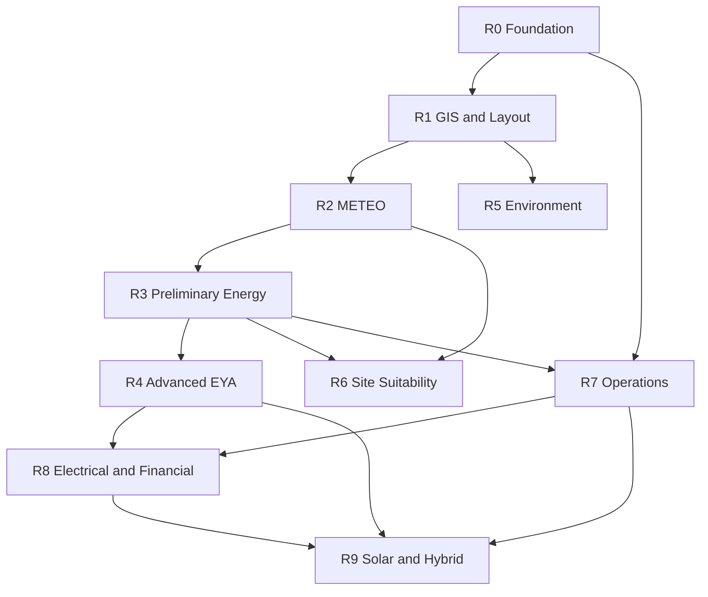

# Dependency Map

**Document ID:** DEP-001  
**Status:** Proposed  
**Last updated:** 2026-07-19

---

## Release-level dependencies



## Hard constraints

| Constraint | Rule |
|------------|------|
| No engineering calc modules before R0 stable | Blocking |
| R1 before layout-dependent energy/environment | Blocking |
| R2 before distribution-based energy | Blocking |
| Research before any calculation implementation | Blocking |
| Internal CFD / advanced flow model | Requires separate scientific approval (R4) |

## Soft parallelism

- R5 research may start after R1 map primitives exist  
- R7 data-contract research may start late R3  
- R8 financial methodology research may proceed in parallel with R7 implementation **only** as research, not code  

## R0 internal dependency chain

```text
CAP-R0-01 Skeleton
  → Auth
    → Organizations → Org membership
      → Projects → Project permissions
        → Audit (can start after Auth in parallel with Projects carefully)
        → Files
        → CalculationRun → Logs → Method registry → Report artifacts
          → Basic report generation
          → Ops (backups/monitoring/rollback) — can parallelize after Skeleton
            → R0 E2E validation
```
